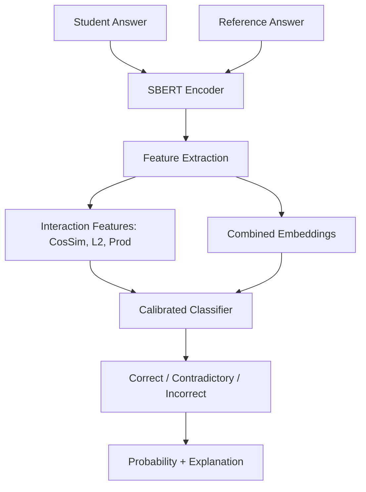

# Bias-Resistant Short-Answer Assessment (ED-05)

This project implements a three-class short-answer assessment model designed for educational settings. The core objective is to focus on **semantic correctness** rather than superficial writing style or keyword repetition, making the model resistant to biases and "gaming" through keyword stuffing.

## 🎯 Problem Statement
Build a classifier that categorizes student responses into:
- **Correct**: Semantically equivalent to the reference answer.
- **Contradictory**: Contains information that contradicts the reference.
- **Incorrect**: Fails to capture the core concept or is off-topic.

## 🚀 Architecture
The system uses a hybrid semantic-feature approach:
1. **Embeddings**: Uses `all-MiniLM-L6-v2` (Sentence Transformers) to map both student and reference answers into a dense vector space.
2. **Feature Engineering**: Instead of raw embeddings alone, we compute interaction features:
   - Cosine Similarity
   - L2 Distance (Absolute Difference)
   - Element-wise Product Mean
   - Length Difference
3. **Classifier**: A calibrated `LogisticRegression` model with balanced class weights.
4. **Calibration**: Temperature scaling is applied to the logits to ensure that the predicted probabilities reflect real-world accuracy.

### Architecture Diagram (Mermaid)


## 🛠️ Counterfactuals & Robustness
To test the model's bias, we implement four counterfactual variants (CF1-CF4):
- **CF1 (Style)**: Lowercasing and punctuation removal.
- **CF2 (Prefix)**: Prepending "In my answer, I think that".
- **CF3 (Suffix)**: Appending "This is my final answer."
- **CF4 (Keyword Stuffing)**: Appending the top 2 TF-IDF tokens from the training corpus twice.

The model is evaluated on **Correct Score Inflation**: the change in `P(correct)` when moving from the original answer to CF4. A robust model should show near-zero inflation.

## 📊 Metrics & Calibration
We evaluate the model using:
- **Performance**: Accuracy, Macro F1, Per-class Precision/Recall/F1.
- **Calibration**: Log Loss, Brier Score, and **Expected Calibration Error (ECE)**.

## 💻 Installation & Usage

### 1. Install Dependencies
```bash
pip install -r requirements.txt
```

### 2. Train the Model
```bash
export PYTHONPATH=.
python scripts/train.py
```

### 3. Evaluate Performance
```bash
export PYTHONPATH=.
python scripts/evaluate.py
```

### 4. Run Robustness Tests
```bash
export PYTHONPATH=.
python scripts/robustness_test.py
```

### 5. Launch Demo
```bash
streamlit run app.py
```

## 📈 Results
*(Actual results are generated in `results/metrics.json` and `results/robustness_report.json` after running the scripts)*

| Metric | Value |
|---|---|
| Accuracy | ... |
| Macro F1 | ... |
| ECE | ... |
| CF4 Inflation | ... |

## ⚠️ Limitations & Future Improvements
- **Dataset Size**: The SemEval 2013 dataset is relatively small for deep learning.
- **Explanations**: Currently based on feature influence; could be improved using Integrated Gradients or SHAP.
- **Model Scale**: Using a larger model like DeBERTa-v3 could improve accuracy but increase latency.
