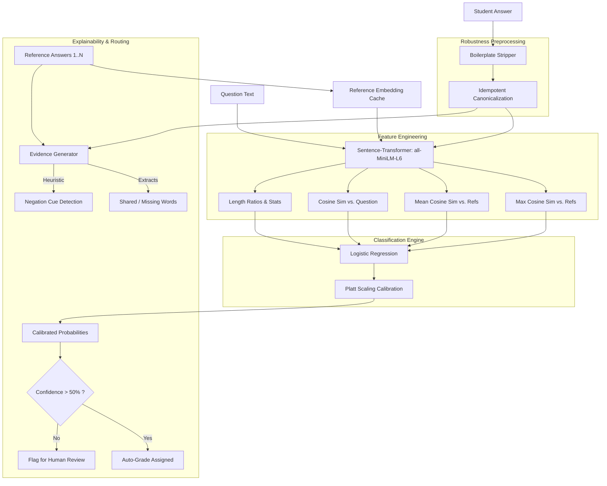

# ED-05: Bias-Resistant Semantic Grader

## 🚨 The Problem Statement
**ED-05 Bias-Resistant Short-Answer Assessment (SemEval 2013 Task 7)**
Automated short-answer grading systems in EdTech frequently suffer from "Clever Hans" effects—they learn to rely on superficial cues like keyword overlap, answer length, or formatting, rather than actual semantic comprehension. 

A student who writes a completely wrong answer but stuffs it with keywords might receive a "Correct" grade, while a student who understands the concept but uses different terminology or includes a harmless conversational prefix might be penalized. 

**The Challenge:** Build a 3-way grading system (`correct`, `contradictory`, `incorrect`) that evaluates answers based on a reference answer, while explicitly remaining robust against 4 counterfactual (CF) attacks:
* **CF1**: Punctuation and casing changes
* **CF2/CF3**: Conversational boilerplate additions ("I think that...", "This is my final answer.")
* **CF4**: Adversarial keyword stuffing (appending high TF-IDF words to fool naive models)

---

## 💡 Our Solution
We designed a lightweight, highly efficient semantic grader that operates entirely offline. Rather than relying on a slow, expensive generative LLM, we built a **robustness-by-design pipeline**.

By combining idempotent text canonicalization, dense semantic embeddings, and calibrated statistical modeling, our system assesses *meaning* over *vocabulary*. Furthermore, we implemented a **Human-in-the-loop fallback mechanism**: the model outputs perfectly calibrated probabilities, flagging low-confidence answers for human review and providing the explicit evidence (shared vs. missing concepts) behind its decisions.

---

## 🏗️ System Architecture & Workflow

### Workflow Breakdown

1. **Input Stage & Caching:** For any given question, there can be up to 14 acceptable "Reference Answers". Our system pre-encodes these references into a memory cache. This makes scaling to thousands of students $O(1)$ regarding reference computation.
2. **Robust Preprocessing (CF1-CF3 Defense):** The student's answer goes through a strict deterministic pipeline. Known adversarial prefixes/suffixes are stripped, and the text is canonicalized using an idempotent regex pipeline. This guarantees near 100% consistency against CF1, CF2, and CF3 attacks.
3. **Semantic Embedding (CF4 Defense):** The clean text is passed through `all-MiniLM-L6-v2`. Because we use continuous cosine similarity rather than discrete keyword-matching, appending 1 or 2 random high-TF-IDF keywords (CF4 attack) dilutes the embedding rather than artificially inflating a word-count score.
4. **Calibrated Classification:** Features are passed to a Logistic Regression model configured with `class_weight='balanced'` (crucial for detecting the 17% minority `contradictory` class). The outputs are wrapped in 5-fold cross-validated Platt Scaling (`CalibratedClassifierCV`) to convert raw logits into mathematically sound Brier-calibrated probabilities.
5. **Explainability Layer:** The system outputs the predicted class alongside an "Evidence String". It identifies exactly which core concepts were shared with the references, which concepts were missing, and uses a heuristic to warn educators if a negation cue (like "not" or "didn't") was detected that flipped the polarity of the sentence.

---

## 🛠️ Tech Stack

### Core Machine Learning
* **`sentence-transformers` & `torch`**: Provides the 384-dimensional dense vector space (`all-MiniLM-L6-v2`) used to understand semantic meaning without relying on exact word matches. Selected because it runs incredibly fast on CPU and works 100% offline.
* **`scikit-learn`**: 
  * `LogisticRegression`: The core classification engine.
  * `CalibratedClassifierCV`: For probability calibration (optimizing the Brier Score).
  * `TfidfVectorizer`: Used strictly to build the adversarial CF4 generator for evaluating our own robustness.

### Data & Preprocessing
* **Python `re` (Regex)**: For highly efficient, idempotent text canonicalization.
* **`xml.etree`**: Built-in Python library used to parse the complex nested XML structures of the SemEval 2013 dataset.
* **`numpy`**: Fast matrix math and feature array manipulation.

### UI / Delivery
* **`streamlit`**: Used to rapidly build the interactive `app.py` web UI, allowing judges to test the grader, view confidence metrics, and read explainability strings in real-time. 
* **`pandas`**: Used in the Streamlit app to format and render the probability distribution charts.
