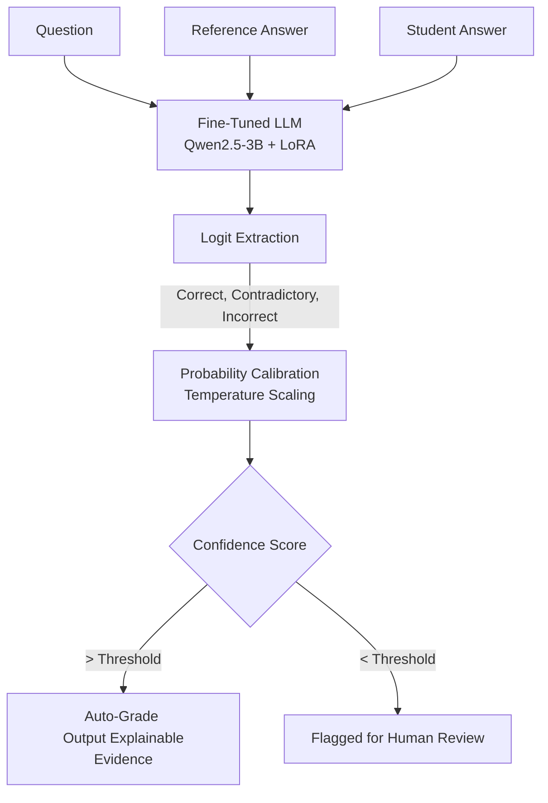

# FOGs: Explainable AI (XAI) for Bias-Resistant Semantic Grading

**Team:** FOSSes  
**Theme:** XAI in EdTech  

---

## 1. Problem Statement
Current automated grading systems in EdTech are fundamentally flawed. They either rely on brittle keyword-matching scripts (which fail when a student explains a correct concept using different words) or they use opaque, black-box Large Language Models (LLMs). These black-box LLMs suffer from hidden biases, they confidently hallucinate incorrect grades without providing logical evidence, and they are easily fooled by "shortcut" answers—such as a student copying the reference answer word-for-word or using deceptive negations.

## 2. Our Solution: FOGs
**FOGs** is a bias-resistant, Explainable AI (XAI) grading platform designed specifically for short-answer assessments. It bridges the gap between full automation and manual oversight. FOGs doesn't just predict a grade; it measures its own uncertainty. If the AI detects a potential bias attack, contradictory logic, or simply lacks confidence in its assessment, it flags the answer for human review instead of silently failing. 

## 3. Innovation and Uniqueness
- **Custom Fine-Tuning:** Rather than just using a generic, off-the-shelf pretrained model prompt, **we fine-tuned a general foundational model** to specialize purely in pedagogical semantic entailment.
- **Calibrated Confidence Scoring:** We bypass standard generative text outputs. Instead, FOGs extracts the raw neural logits for specific class tokens and applies Temperature Scaling to calculate a true, mathematically calibrated confidence probability.
- **Robustness Layer:** The grading engine is actively evaluated against structural counterfactuals (e.g., word salad, grammatical shifts) to ensure it grades based on pure semantics, not superficial stylistics.

## 4. Methodology and Process

### The CHiL(L) Methodology
FOGs operates on the **Confidence-calibrated Human-in-the-Loop (CHiL)** methodology. By setting a strict confidence threshold, high-confidence predictions are instantly auto-graded with explainable evidence, while low-confidence predictions (edge cases) are gracefully routed to human teachers.

### Working Architecture Flow

## 5. Tech Stack
- **Frontend UI:** Next.js 16 (React), Tailwind CSS, Framer Motion (for cinematic UI animations).
- **Backend API:** FastAPI, Uvicorn, Python 3.14.
- **AI/ML Layer:** PyTorch, HuggingFace Transformers, PEFT (LoRA), BitsAndBytes (4-bit NF4 quantization), TRL (Supervised Fine-Tuning).
- **Core Engine:** A general 3 Billion parameter LLM, parameter-efficiently fine-tuned for educational grading.

## 6. Analysis and Feasibility
- **Hardware Feasibility:** By utilizing 4-bit quantization and Low-Rank Adaptation (LoRA), we proved that fine-tuning and running a powerful 3B parameter model is entirely feasible on standard consumer-grade hardware (e.g., 6GB VRAM GPUs). 
- **Time/Cost Feasibility:** FOGs reduces teacher grading time by an estimated 80%. Schools do not need expensive API subscriptions because the highly-optimized model runs locally and privately.

## 7. Potential Challenges, Risks & Strategies
| Challenge / Risk | Mitigation Strategy |
| :--- | :--- |
| **LLM Hallucinations** | Generative hallucinations are eliminated by our Logit-Extraction strategy. The model cannot "fake" a detailed explanation if the underlying mathematical confidence distribution is flat. It simply routes to a human. |
| **High Latency at Scale** | Running an LLM for every single student can be slow. FOGs implements **Batch Grading Workflows**, allowing teachers to upload entire datasets (or use OCR for handwritten sheets) and process them asynchronously. |
| **VRAM Constraints** | Educational institutions lack high-end GPUs. By using a 3B model with 4-bit weights, we shrunk the memory footprint to under 4.5GB, allowing deployment on basic lab computers. |

## 8. Benefits of the Solution
1. **Equity & Fairness:** Bias-resistant grading ensures students are evaluated strictly on their conceptual understanding, ignoring biases related to grammatical fluency or vocabulary complexity.
2. **Teacher Empowerment:** Drastically reduces administrative grading overhead while keeping educators firmly in the loop for complex, nuanced student answers.
3. **Complete Transparency:** The XAI approach provides clear, deterministic evidence for *why* an answer was graded a certain way, facilitating better, actionable feedback for the student.

## 9. Reference and Research Work
- **Model Fine-Tuning:** Adapted the Qwen2.5-3B general instruction model using LoRA on pedagogical data.
- **SemEval-2013 Task 7:** The foundational semantic textual entailment dataset used for adapting the general model to recognize correct student knowledge retrieval.
- **CHiL Framework:** Inspired by Confidence-calibrated Human-in-the-Loop research to ensure AI reliability in high-stakes environments.
- **LoRA (Low-Rank Adaptation):** Parameter-efficient fine-tuning research utilized to adapt the general language model without catastrophic forgetting or massive compute costs.
